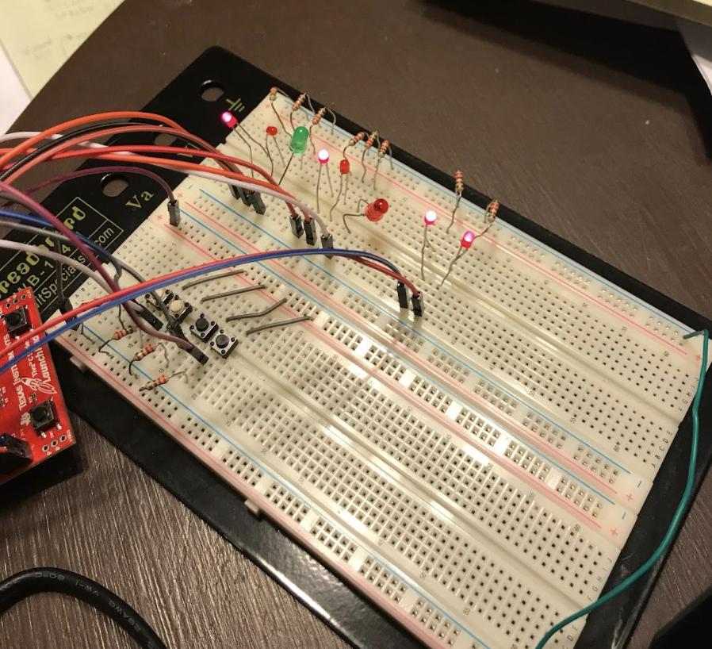
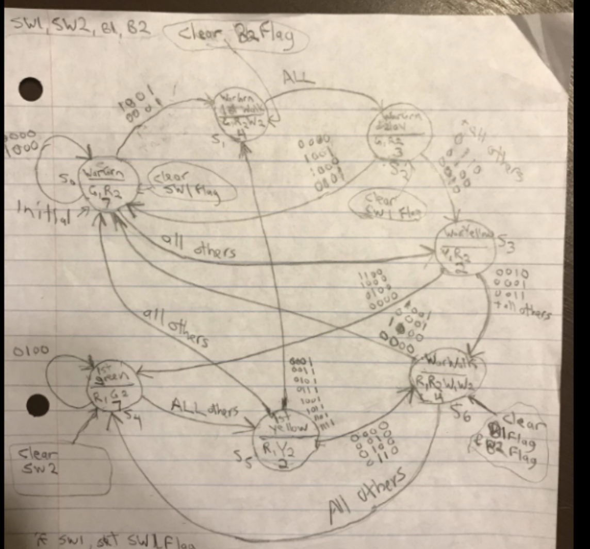
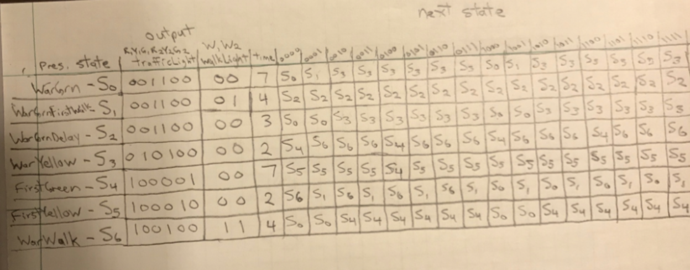

<h1>Traffic Light Controller</h1>
<h3>Sam Miller and Danny Yang</h3>
<h3>10/19/17</h3>

For this project, we had to implement a traffic controller for the intersection of Warner Street and 1st Street.  Each street has a traffic light (Red,Yellow,Green) and a Walk light.  Each street has a car sensor (SW1,SW2) and a button for pedestrians (B1,B2).  A green light should hold for 7 seconds, a yellow light should hold for 2 seconds, and a Walk signal should hold for 4 seconds.  Lights should never both be green, and a Walk signal should never occur across a street whose light is green.

We first figured out how many states we would need.  We needed 7 altogether.  Sensor/button inputs should be acknowledged in the order they are received.   If multiple requests can be serviced simultaneously without causing conflict/safety hazard, they should be (ex. both streets can have Walk signals if both traffic lights are red.)  We came up with all possible transitions via a state transition graph, and transferred them to a state transition table.

We simulated traffic lights and Walk signals with LEDs, and used push buttons as sensor and button inputs.  We wrote C code to control our ARM Launchpad microcontroller.  We organized the states as an array of linked structures – each state structure included a 6-bit trafficLight, 2-bit walkLight, hold time (in seconds), 4-bit "clearServicedInputs", and array of possible next states (pointers).

